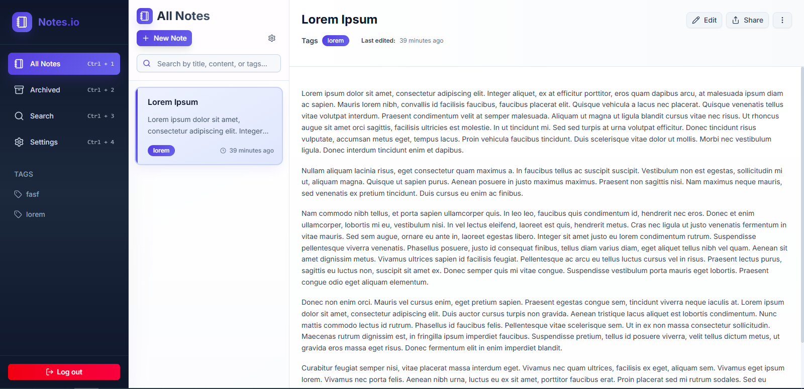
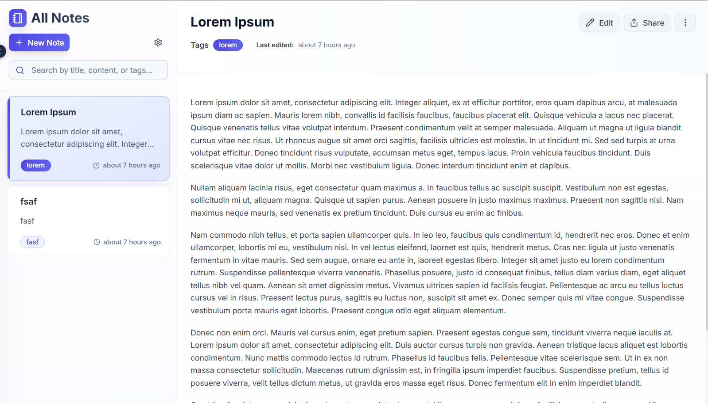
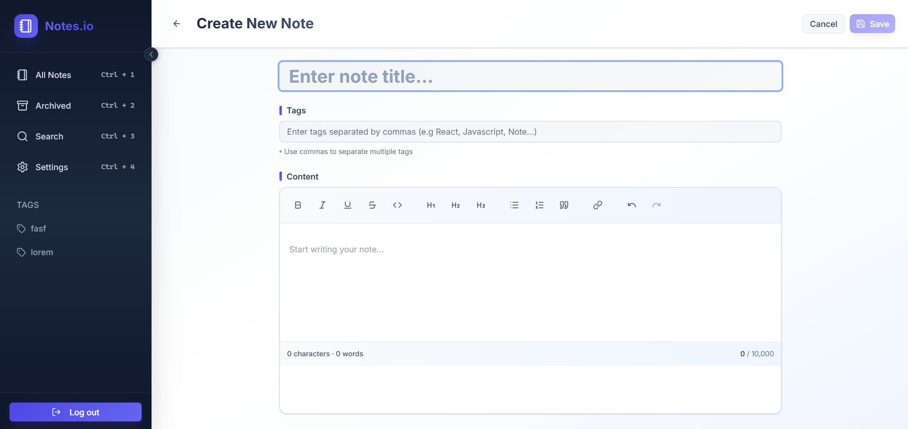
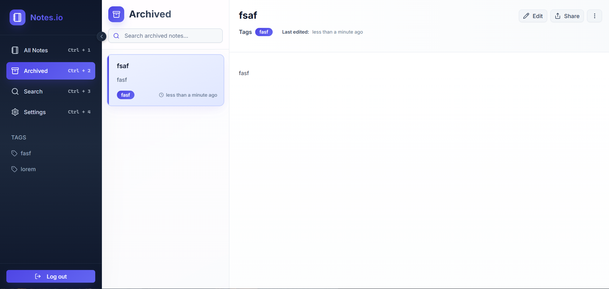
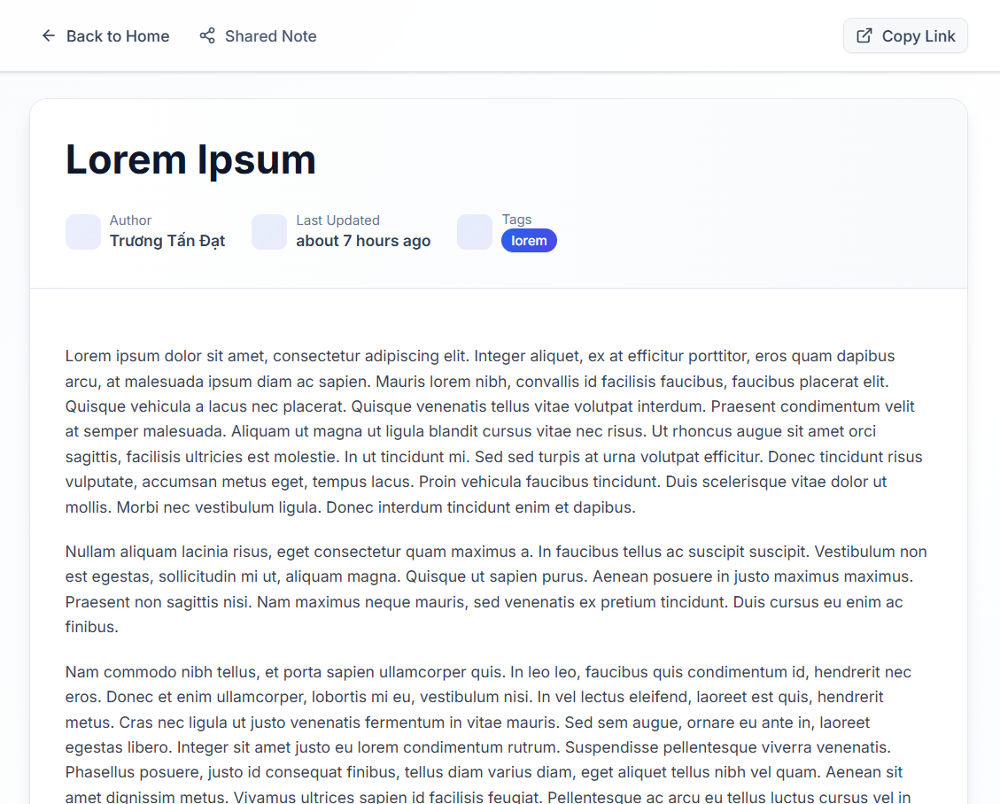

<h1 align="center">Welcome to Notes App 👋</h1>
<p>
  <a href="https://mit-license.org/" target="_blank">
    
  </a>
</p>

> Capture your thoughts, organize your ideas, and boost your productivity with my beautiful and intuitive note-taking app.



**Notes App** is a modern, minimal, and user-friendly web application for creating and managing personal notes.  
It focuses on simplicity, speed, and scalability using modern frontend tooling and a cloud-ready backend.

🔗 **Live Demo:** https://notes-app-sgu-std.vercel.app/  
📦 **Repository:** https://github.com/tandat0303/Notes-App

---

## 🚀 Features

- 📝 Create, edit, and delete notes
- 🗂️ Archive and organize notes
- ⚡ Fast development with **Vite**
- ☁️ Backend support using **Convex**
- 📱 Responsive UI for desktop & mobile
- 🚀 Production-ready deployment (Vercel)

---

## 🛠️ Tech Stack

| Technology | Description |
|-----------|-------------|
| **JavaScript (ES6+)** | Core application logic |
| **HTML / CSS** | UI structure and styling |
| **Vite** | Fast build tool & dev server |
| **Convex** | Serverless backend & database |
| **Node.js** | Development environment |
| **Vercel** | Deployment platform |

---

## 🖼️ Screenshots

### 🏠 Notes List


### ✏️ Create & Edit Note


### 🗂️ Archived Notes


### 🔗 Shared Note


---

## 📥 Installation & Setup

1. Clone the repository
```sh
git clone https://github.com/tandat0303/Notes-App.git
cd Notes-App
```

2. Install dependencies
```sh
npm install
```

3. Configure environment variables

Create a `.env` file based on the example:
```sh
cp .env.example .env
```

Fill in the required values (e.g., Convex project configuration).

4. Run the development server
```sh
npm run dev
```

The app will be available at:
```sh
http://localhost:5173
```

---

## 🚀 Deployment
This project is optimized for Vercel deployment.

Steps:
  
  1. Push your code to Github
  2. Import the repository into Vercel
  3. Set the environment variables
  4. Deploy

---

## 🧪 Usage
  * Open the app in your browser
  * Create new notes instantly
  * Click on a note to edit
  * Archive notes you no longer need
  * Enjoy a clean and distraction-free writing experience
> Backend features require proper Convex configuration.

---

## Author

👤 **Truong Tan Dat**

* Website: https://truongtandat.vercel.app/
* Github: [@tandat0303](https://github.com/tandat0303)
* LinkedIn: [Tan Dat Truong](https://www.linkedin.com/in/tan-dat-truong-71a760364/)

---

## Support

If you find this project useful:

  ⭐ Star the repository

  🐞 Report issues

  💡 Suggest new features

--- 

## 📝 License

Copyright © 2026 [Truong Tan Dat](https://github.com/tandat0303).<br />
This project is [MIT](https://github.com/tandat0303/Notes-App?tab=MIT-1-ov-file) licensed.
